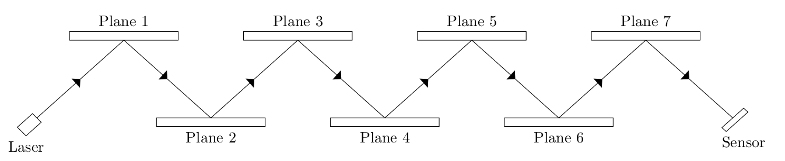
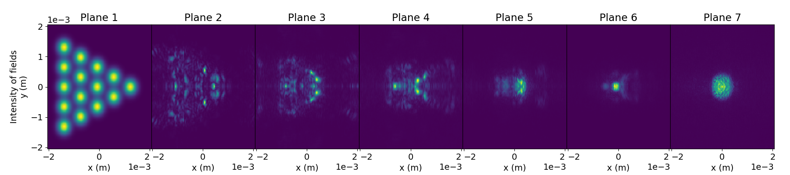
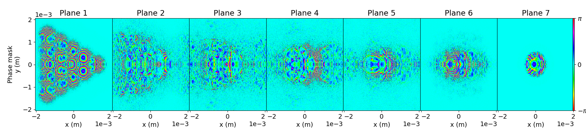

# Multi-plane Light Conversion


Simulation of the Multi-Plane Light Conversion (MPLC)[^1] based on the article by Fontaine *et al* [^2]. This technology transform a set of Gaussian beams into a compacted Hermite-Gaussian Beams, which can be transformed into Laguerre-Gaussian (LG) beams[^3]. In telecommunication services, LG beams are used to transfer information over the atmosphere with low losses[^4].

A simplified scheme of the MPLC technology is represented in Figure [1](#fig:MPLC). The simulation uses the wavefront matching algorithm[^5] to calculate the fields and phase masks at each plane. The intensity of the fields at each plane that reflected the fields are shown in Figure [2](#fig:fields). The correspondent phase masks are shown in Figure [3](#fig:masks).


<figure>
<figcaption>Figure  <a id="fig:MPLC">1</a>. Simplified scheme representing the MPLC technology. </figcaption>

</figure>

<figure>
<figcaption>Figure  <a id="fig:fields">2</a>. Plot of the intensity of the fields at the different planes of the MPLC. </figcaption>

</figure>

<figure>
<figcaption>Figure  <a id="fig:masks">3</a>. Plot of the phase masks at the different planes of the MPLC. </figcaption>


</figure>

[^1]: J.-F. Morizur, L. Nicholls, P. Jian, S. Armstrong, N. Treps, B. Hage, M. Hsu, W. Bowen, J. Janousek, and H.-A. Bachor. Programmable unitary spatial mode manipulation. Journal of the Optical Society of America A, 26(11), 2010.

[^2]: N. K. Fontaine, R. Ryf, H. Chen, D. T. Neilson, K. Kim, and J. Carpenter. Laguerre-gaussian mode sorter. Nature Communications,
10(1865), 2019.

[^3]: L. Allen, M. W. Beijersbergen, R. J. C. Spreeuw, and J. P. Woerdman. Orbital angular momentum of light and the transformation
of laguerre-gaussian laser modes. Physical Review A, 45(8185), 1992.

[^4]: J. M. Kahn A. Belmonte. Optimal modes for spatially multiplexed free-space communication in atmospheric turbulence. Optics Express, 29(26), 2021.

[^5]: Y. Sakamaki, T. Saida, T. Hashimoto, and H. Takahashi. New optical waveguide design based on wavefront matching method.
Journal of Lightwave Technology, 25(11), 2007.

## Installation

Use the package manager [pip](https://pip.pypa.io/en/stable/) to install MPLC

```bash
pip install MPLC
```

## Usage

The package comes with a jupyter notebook called "example.ipynb", to exemplify the usage of the code.

```python
from MPLC.system import System

# Start the system with the default variables
s = System()

# Create Gaussian beams with 5 modes ( 15 beams ) in a triangle position
Gaussian = s.create_Gaussians(num_modes=5, positions="triangle")

# Plot the Gaussians
fig,ax = Gaussian.plot()

# Create Hermite Gaussian beams

Hermite = s.create_HermiteGaussian()

# Set the beams in the system
s.set_fields(Gaussian,Hermite)

# Start the process of compressing the Gaussians into Hermite Gaussian beams
s.start()

# Calculate the matrix with single values of the transfer matrix, the insertion loss and the mode-dependent loss
s, IL, MDL = s.get_couplingMatrix()
```

## Contributing

Pull requests are welcome. For major changes, please open an issue first
to discuss what you would like to change.


## License

[CC 1.0 universal](https://creativecommons.org/publicdomain/zero/1.0/deed.pt)

## Author

Joao Abreu